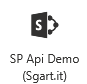
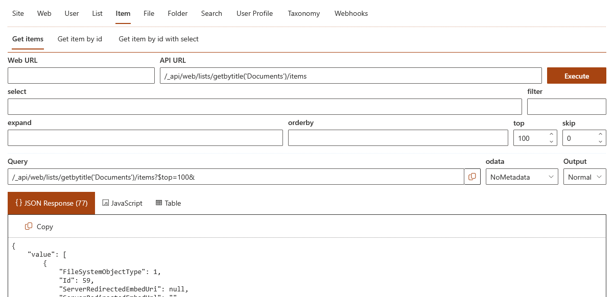
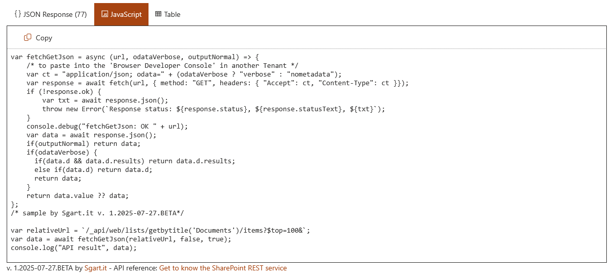

# sgart-spfx-sp-api-demo

## Summary

Webpart SPFx per testare le chiamate GET alle API di SharePoint API. 







### Esempio di JavaScript generato

```javascript
var fetchGetJson = async (url, odataVerbose, outputNormal) => {
    /* to paste into the 'Browser Developer Console' in another Tenant */
    var ct = "application/json; odata=" + (odataVerbose ? "verbose" : "nometadata");
    var response = await fetch(url, { method: "GET", headers: { "Accept": ct, "Content-Type": ct }});
    if (!response.ok) {
        var txt = await response.json();
        throw new Error(`Response status: ${response.status}, ${response.statusText}, ${txt}`);
    }
    console.debug("fetchGetJson: OK " + url);
    var data = await response.json();
    if(outputNormal) return data;
    if(odataVerbose) {
      if(data.d && data.d.results) return data.d.results;
      else if(data.d) return data.d;
      return data;
    } 
    return data.value ?? data;
};
/* sample by Sgart.it v. 1.2025-07-26.BETA*/

var relativeUrl = `/_api/web/lists/getbytitle('Documents')/items?$top=500&`;
var data = await fetchGetJson(relativeUrl, false, true);
console.log("API result", data);
```

## Debug

La prima volta che si scarica il progetto (git clone)

npm install

**NON** modificare il file **serve.json** deve avere la variabile **{tenantDomain}** ( initialPage="https://{tenantDomain}/sites/siteName/_layouts/workbench.aspx" ) aggiornare solo **siteName**.

Per fare dedug sostituire **tenantName** nel comandi qui sotto:

 $env:SPFX_SERVE_TENANT_DOMAIN="tenantName.sharepoint.com"; gulp serve --nobrowser

per fare deploy con la solution installata indicare la query string

https://tenantName.sharepoint.com/_layouts/15/workbench.aspx?debug=true&noredir=true&debugManifestsFile=https://localhost:4321/temp/build/manifests.js

## Deploy

gulp clean ; gulp bundle --ship ; gulp package-solution --ship

caricare il file .\sharepoint\solution\packageName.sppkg nell [App Catalog](https://tenantName-admin.sharepoint.com/_layouts/15/tenantAppCatalog.aspx) o di [site collection](https://tenantName.sharepoint.com/sites/siteName/AppCatalog).

## Links

[SPFx Full width](https://learn.microsoft.com/en-us/sharepoint/dev/spfx/web-parts/basics/use-web-parts-full-width-column)


## Used SharePoint Framework Version


## Applies to

- [SharePoint Framework](https://aka.ms/spfx)
- [Microsoft 365 tenant](https://docs.microsoft.com/en-us/sharepoint/dev/spfx/set-up-your-developer-tenant)

> Get your own free development tenant by subscribing to [Microsoft 365 developer program](http://aka.ms/o365devprogram)

## Prerequisites

> Any special pre-requisites?

## Solution

| Solution    | Author(s)                                               |
| ----------- | ------------------------------------------------------- |
| folder name | Author details (name, company, twitter alias with link) |

## Version history

| Version | Date             | Comments        |
| ------- | ---------------- | --------------- |
| 1.1     | March 10, 2021   | Update comment  |
| 1.0     | January 29, 2021 | Initial release |

## Disclaimer

**THIS CODE IS PROVIDED _AS IS_ WITHOUT WARRANTY OF ANY KIND, EITHER EXPRESS OR IMPLIED, INCLUDING ANY IMPLIED WARRANTIES OF FITNESS FOR A PARTICULAR PURPOSE, MERCHANTABILITY, OR NON-INFRINGEMENT.**

---

## Preparazione ambiente

Per vedere la versione di Node JS corrente

node -v

Per installare una versione di Node JS aggiuntiva

nvm install 18.19.0

Per cambiare versione di Node JS (https://github.com/coreybutler/nvm-windows)

nvm use 18.19.0

npm install gulp-cli yo @microsoft/generator-sharepoint --global

gulp trust-dev-cert

## References

- [Getting started with SharePoint Framework](https://docs.microsoft.com/en-us/sharepoint/dev/spfx/set-up-your-developer-tenant)
- [Building for Microsoft teams](https://docs.microsoft.com/en-us/sharepoint/dev/spfx/build-for-teams-overview)
- [Use Microsoft Graph in your solution](https://docs.microsoft.com/en-us/sharepoint/dev/spfx/web-parts/get-started/using-microsoft-graph-apis)
- [Publish SharePoint Framework applications to the Marketplace](https://docs.microsoft.com/en-us/sharepoint/dev/spfx/publish-to-marketplace-overview)
- [Microsoft 365 Patterns and Practices](https://aka.ms/m365pnp) - Guidance, tooling, samples and open-source controls for your Microsoft 365 development
